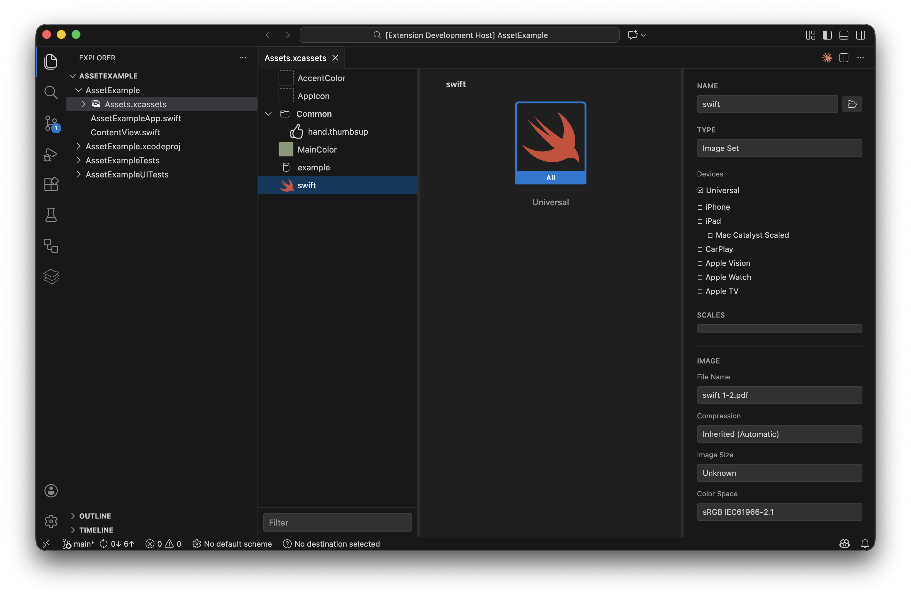

# Asset Catalog Viewer

[](https://marketplace.visualstudio.com/items?itemName=artemnovichkov.asset-catalog-viewer)
[](https://open-vsx.org/extension/artemnovichkov/asset-catalog-viewer)


A VS Code and Cursor extension that provides an Xcode-like interface for previewing and inspecting `.xcassets` (Asset Catalog) directories. View your iOS, macOS, and other Apple platform assets with the same visual experience you get in Xcode.



## Features

### 🎨 Asset Type Support

- **Image Sets** - View all scale variants (@1x, @2x, @3x) with device-specific variants (iPhone, iPad, Mac, Apple Watch, Apple TV, Apple Vision)
- **PDF Support** - View PDF vector assets
- **Color Sets** - Preview colors with light/dark mode variants, high contrast support, and color space information
- **App Icon Sets** - Browse app icons organized by size and appearance variants
- **Data Sets** - View data assets with content preview for text-based files
- **Lottie Animations** - Preview Lottie JSON and dotLottie (.lottie) animations with playback controls

### 🖥️ Xcode-Like Interface

- **Three-Panel Layout** - Mimics Xcode's asset catalog viewer:
  - **Left Panel**: Hierarchical asset list with thumbnails and folder navigation
  - **Middle Panel**: Visual preview of selected assets with all variants
  - **Right Panel**: Detailed properties and metadata inspector

### ✨ Interactive Features

- **Asset Management** - Rename and delete assets or folders directly from the interface
- **Search Filter** - Filter assets by name in real-time across all folders
- **Large Asset Detection** - Identify heavy assets with visual warning indicators (⚠️) in the sidebar
- **SwiftUI Code Snippets** - Quick copy resource accessors (e.g., `Color(.brand)`) for Color and Image sets
- **Variant Selection** - Click on individual image/color variants to see detailed properties
- **Quick Look** - Press Space to open selected assets in macOS Quick Look
- **Show in Finder** - Right-click any asset to reveal it in Finder
- **Resizable Panels** - Drag panel dividers to customize the layout

## Installation

### From Marketplace

1. Open VS Code or Cursor
2. Go to Extensions (⌘⇧X / Ctrl+Shift+X)
3. Search for "Asset Catalog Viewer"
4. Click Install

### Manual Installation

1. Clone this repository
2. Run `npm install`
3. Press `F5` to open a new Extension Development Host window
4. The extension will be active in the development host

## Usage

### Opening an Asset Catalog

1. **From Explorer**:
   - Right-click any `.xcassets` directory in Explorer
   - Select "Open Asset Catalog Viewer" from the context menu

2. **From Command Palette**:
   - Press `⌘⇧P`
   - Type "Open Asset Catalog Viewer"
   - Select the command and choose your `.xcassets` directory

## Configuration

You can customize the extension behavior via VS Code settings:

| Setting | Default | Description |
|:---|:---|:---|
| `assetCatalogViewer.largeAssetThreshold` | `500` | Threshold in KB. Assets larger than this value will show a warning icon in the asset list. |

## Development

### Prerequisites

- Node.js (v18 or later)
- npm
- VS Code
- TypeScript

### Setup

```bash
# Install dependencies
npm install

# Compile TypeScript
npm run compile

# Watch mode for development
npm run watch

# Run linter
npm run lint

# Run tests
npm test
```

### Building

```bash
# Production build
npm run vscode:prepublish
```

### Debugging

1. Open this repository in VS Code
2. Press `F5` to launch the Extension Development Host
3. In the development host, open a workspace with `.xcassets` directories
4. Use the context menu or command palette to open the viewer

## Requirements

- VS Code version 1.85.0 or higher
- macOS (for Quick Look functionality)
- Node.js 18.x or later (for development)

## Contributing

Contributions are welcome! Please feel free to submit a Pull Request.

## Author

Artem Novichkov, https://artemnovichkov.com

## License

The project is available under the MIT license. See the [LICENSE](./LICENSE) file for more info.
